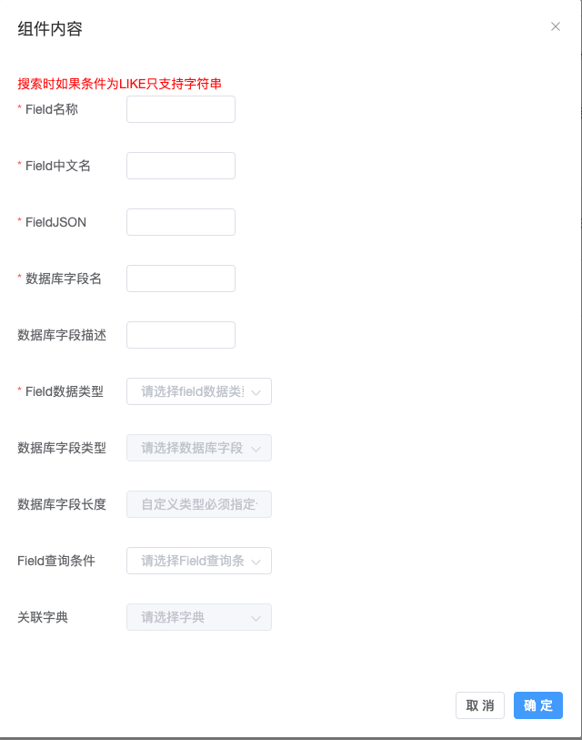
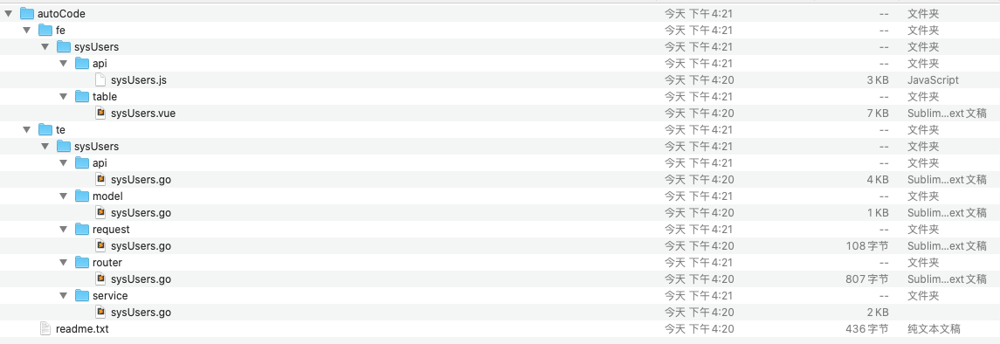
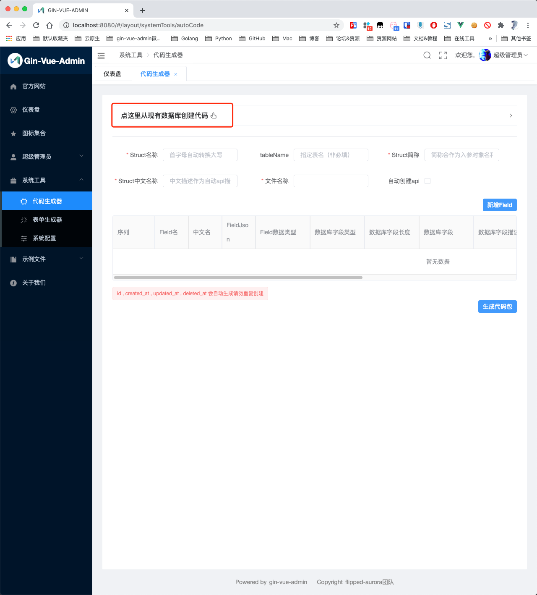
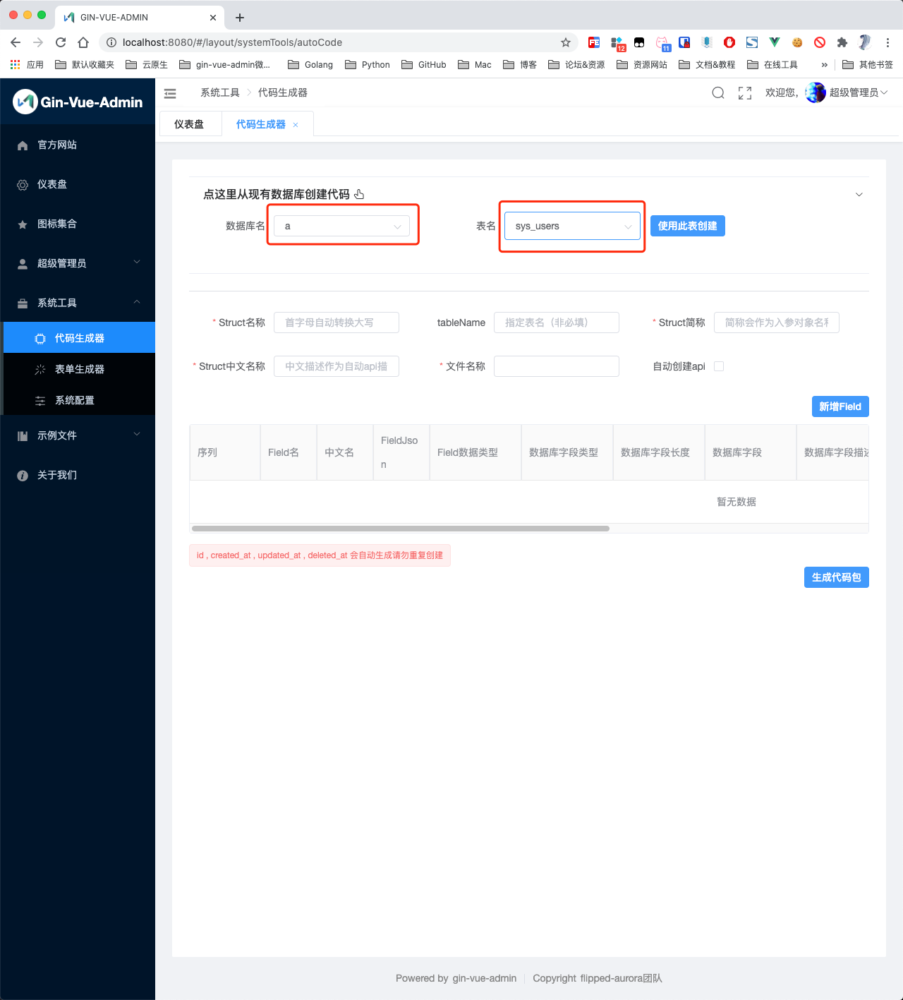
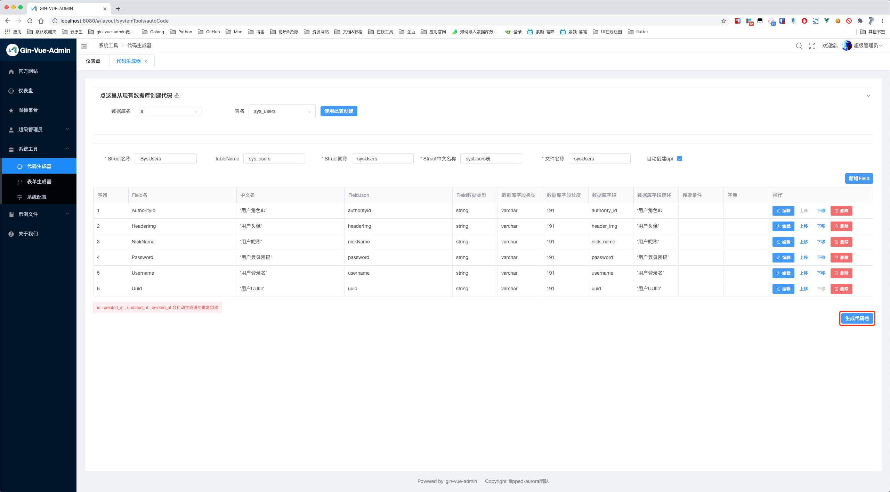
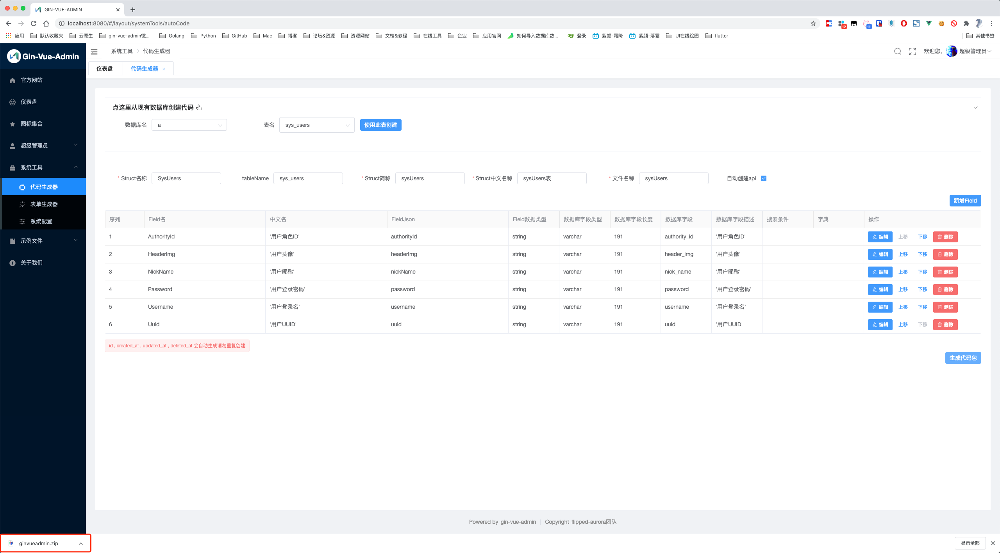

## 1. 生成一步到位代码包

### 参数界面说明

#### `StructName`

- `Struct名称`

- `server/model` 文件夹下的结构体文件中，结构体的名称，首字母必须**大写**。

#### `TableName` 

- `数据库表名`

- 数据库中生成的与结构体对应的数据表名。

#### `PackageName` 

- `Struct简称`

- 用于结构体作为参数时的名称，以及路由 group 名称。这里一般与**Stuct名称**对应，但是首字母小写。

#### `Abbreviation` 

- `Struct中文名称`

- 作为自动api描述，也是左侧菜单显示时的默认菜单名。

#### `Description` 

- `文件名称`

- 使用 xxx_xxx 形式命名。生成后端代码时，model下的文件名会用这里的命名。

#### `AutoCreateApiToSql` 

- `自动创建api`

- 选中，如果不选则不会自动创建api表，需要自己去api管理里面手动增加对应路由。

### 字段界面说明

#### `FieldName`

- `Field名称`

- struct结构体中的字段名称，首字母**大写**

#### `FieldDesc`

- `Field中文名`

- 对应struct结构体tag中的comment字段值，也是数据列表展示表格的表头名称。

#### `FieldJson` 

- `Field Json名`

- 对应struct结构体tag中的json字段值。在使用struct对象调用某个字段时，使用“对象.json字段值”

#### `ColumnName`

- `数据库字段名`

- 对应数据库中的字段名称

#### `ColumnName` 

- `数据库字段描述`

- 对应数据库中的列Comment值

#### `FieldType`

- `Field数据类型`

- 对应struct结构体中的字段类型

#### `DataType` 

- `数据库字段类型`

- 对应生成的数据表中的字段类型

#### `DataTypeLong` 

- `数据库字段长度`

- 对应生成的数据表中的字段长度

#### `FieldSearchType`

- `Field查询条件``

- 用于实现该对象数据列表的条件查询

### 自行设计业务基础结构体模型

点击左侧菜单中的 **系统工具 → 代码生成器** 用来生成相关代码。

参数填写完成后，就填写好了自动创建代码所需要的基本信息。然后点击 **新增Field** 按钮，为数据表、struct结构体创建字段。

创建好所有的field后，点击右下角 **生成代码包** 按钮，会生成并下载一个文件压缩包。解压后会看到里面有个 autoCode 文件夹，autoCode 里的 te 文件夹为自动生成的后端代码，fe文件夹为自动生成的前端代码。

- te文件夹 → 后端代码：
	- api 下的 `.go` 文件放到后端项目中的 api → v1 下。
	- model 下的 `.go` 文件放到后端项目中的 model 下。
	- request 下的 `.go` 文件放到后端项目中的 model → request下。
	- router 下的 `.go` 文件放到后端项目中的 router 下。
	- service 下的 `.go` 文件放到后端项目中的 service 下。
- fe文件夹 → 前端代码：
	- api 下的 `.js` 文件放到前端项目中的 src →api 下。
	- table 下的 `.vue` 文件放到前端项目中的 src → view → [PackageName](#packagename) (文件夹自建）下。

### 数据库的表进行选择进行

- 点击左侧菜单中的**系统工具** > **代码生成器** ,代码生成器是用来生成CURD代码的。
- 点击`点这里从现有数据库创建代码`
- 
- 选择`数据库名`以及`表名`
- 

- 点击**使用此表创建**
- 
- 自行编辑好各个`Filed`的所需的搜索条件,或者其他自己要修改的地方, 修改后点击生成代码

- 

- 点击后就可以看到左下角或者下载内容里有一个下载好了的`ginvueadmin.zip `文件
- 

 解压`ginvueadmin.zip `后会看到里面有个 autoCode 文件夹，autoCode 里的 te 文件夹为自动生成的后端代码，fe文件夹为自动生成的前端代码。

- te文件夹 → 后端代码：
	- api 下的 `.go` 文件放到后端项目中的 api → v1 下。
	- model 下的 `.go` 文件放到后端项目中的 model 下。
	- request 下的 `.go` 文件放到后端项目中的 model → request下。
	- router 下的 `.go` 文件放到后端项目中的 router 下。
	- service 下的 `.go` 文件放到后端项目中的 service 下。
- fe文件夹 → 前端代码：
	- api 下的 `.js` 文件放到前端项目中的 src →api 下。
	- table 下的 `.vue` 文件放到前端项目中的 src → view →[PackageName](#packagename) (文件夹自建）下。

## 2. 注册路由和数据库表

### 注册路由

进入 `server/initialize` → `router.go` 文件，在 `global.GVA_LOG.Info("router register success")` 这行代码前插入一行 router.Init[StructName](structname)Router(ApiGroup)

### 注册数据库表

进入 initialize → gorm.go 文件，在函数 `MysqlTables`  或者 ` GormDBTables`给 `db.AutoMigrate` 方法添加 model.[StructName](structname){}

## 3.配置目录菜单

进入系统 超级管理员 → 菜单管理 菜单，点击 **新增根菜单** 按钮，配置菜单信息。

- 路由name：对应进入列表显示页面时的访问路径
- 路由path：选中后边的“添加参数”后才可以输入，对应进入列表显示页面时访问路径后的参数,具体使用方式看[视频](https://www.bilibili.com/video/BV1jk4y127yg)
- 是否隐藏：是否在系统左侧目录菜单显示时，隐藏掉该目录菜单
- 父节点Id：该目录菜单的父级目录菜单。这里是自动填充的数据，不需要自己操作
- 文件路径：对应前端项目中 /view/ [PackageName](#packagename) (自建)/[StructName](#structname).vue 文件
- 展示名称：该目录菜单显示在系统左侧目录菜单中的名称
- 图标：该目录菜单显示在系统左侧目录菜单中的图标
- 排序标记：用于调整该目录菜单在系统左侧目录菜单中显示的上下位置
- keepAlive：是否使用keepAlive缓存

以上配置好后，点击 **确定** 按钮，完成菜单配置。

## 4.配置后端接口

如果在第一步的`自动创建api`打钩了即可跳过此步

如果是自己写的业务代码，这里需要配置好后端接口。进入系统 超级管理员 → api管理 菜单，点击 **新增api** 按钮，配置接口信息。

- 路径：就是接口路径，比如前端项目中 src → api → [PackageName](#packagename) .js 每个方法里的 url
- 请求：根据接口实际选择即可
- api分组：对应 struct 简称
- api简介：对api的简要说明

以上配置好后，点击 **确定** 按钮，完成接口配置。

## 5.配置角色权限

进入系统 超级管理员 → 角色管理 菜单，找到需要设置权限的角色，点击对应的 **设置权限** 按钮，配置角色相关权限。

- 角色菜单：勾选该角色可以访问的目录菜单
- 角色api：勾选该角色可以访问的接口

## 6：完善新增表单弹窗/页面

以上6个步骤完成后，我们可以在系统中看到我们所创建的结构体数据列表页面。目前，这个页面已经是可以实现 **删除**、**查询** 功能了，**新增**、**修改** 功能仍然需要我们自己完善一下弹窗表单。

进入系统 系统工具 → 表单生成器 菜单，根据自己的实际需求，将左侧组件拖拽至中间画布区域，并在右侧设置组件属性。

- 组件类型：默认是左侧选中的组件类型，这里还可以再进行调整
- 字段名：对应 Step3 中的 **FieldJSON** 字段
- 标题：即组件label
- 占位提示：。。。就是占位提示

把所有组件上边几个基本的组件属性填好以后，点击画布上方的 **复制代码** 按钮，会出现一个弹窗，让我们选择 **生成类型** 是 页面 还是 弹窗。我用的时候选的页面，具体内容应该是没差的，这里选择哪个应该不影响我们目前的需求。然后点击 **确定** 按钮，就成功复制到了我们的表单代码。

接下来，

- 随便找个记事本或者地方，把代码复制到里边。
- 在复制出来的代码中，取出 `<el-form>……</el-form>` 部分代码，覆盖掉前端项目中 src → view →  [PackageName](#packagename)(自建) → [StructName](#structname).vue 中 `此处请使用表单生成器生成form填充 表单默认绑定 formData 如手动修改过请自行修改key` 这句话。
- 在复制出来的代码中，把 js 部分`data`方法里返回的对象复制到前端项目中，上边提及的 .vue 文件的 js 部分 `data` 方法的 `return` 对象里

## Finish

至此，一个单表基本业务结构体的数据列表显示，单表数据增加、删除、查找、更新功能全部搞定。

