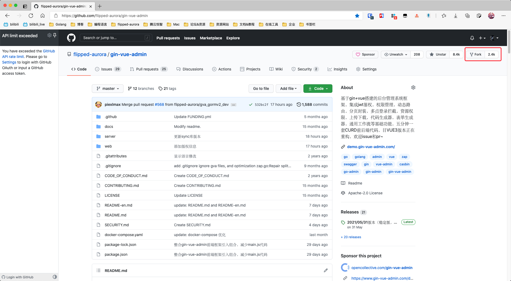
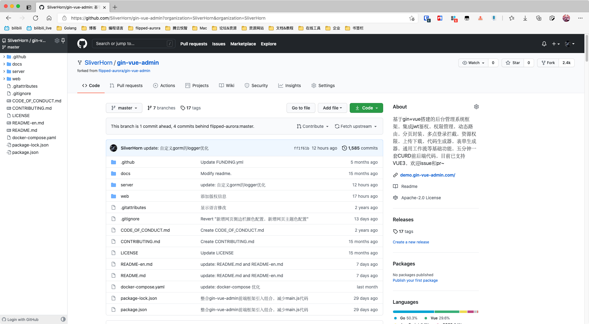
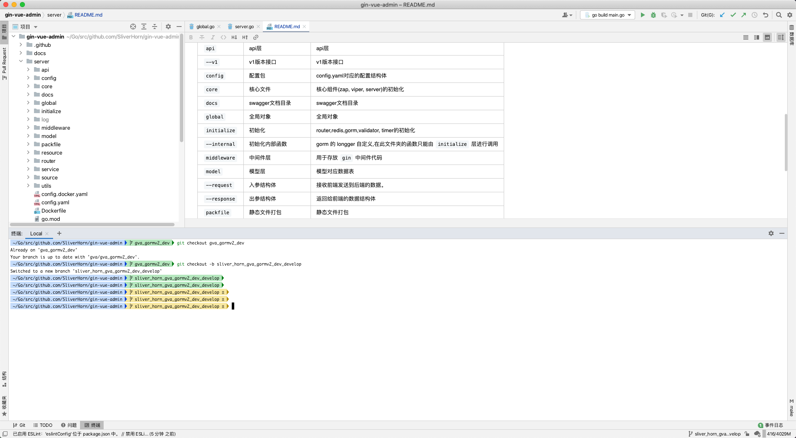
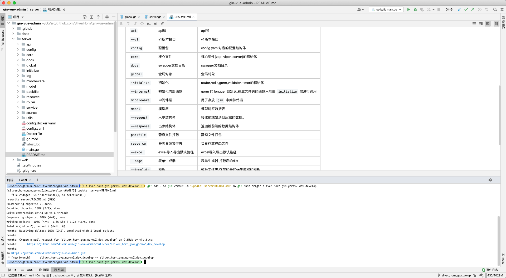
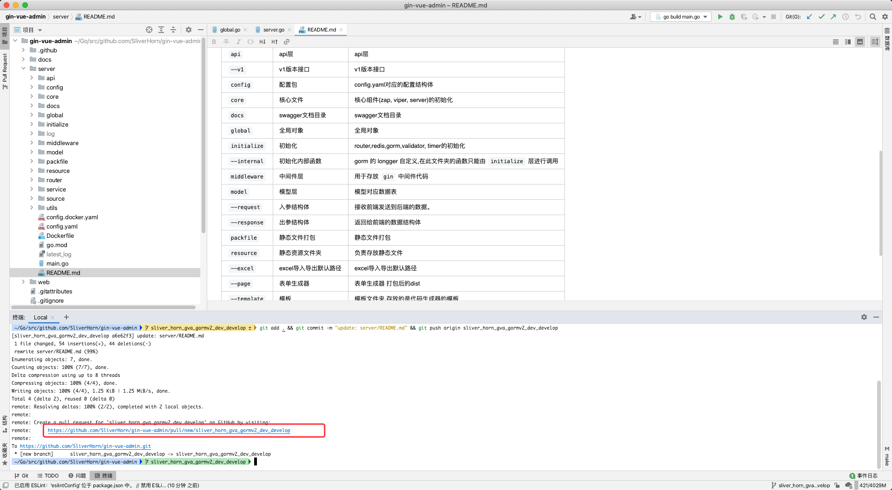
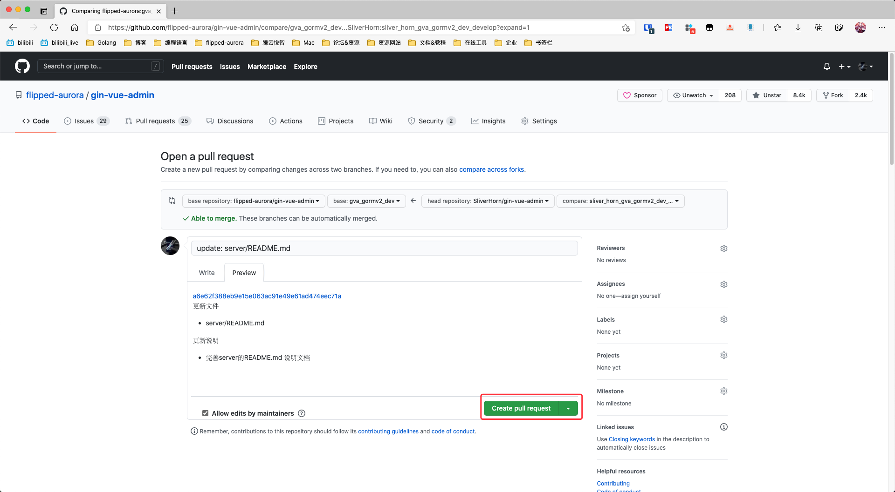

## 1. fork gf-vue-admin repository

首先先fork源仓库



## 2. fork with you github name

选择fork到那个用户或者组织(点自己用户名)

## 3. fork success

fork 成功! 此时您可以看到地址栏上是 https://github.com/SliverHorn/gin-vue-admin 这是SliverHorn 的 gin-vue-admin , 仓库名下方有原仓库的链接地址.



## 4. clone warehouse

```
git clone https://github.com/SliverHorn/gin-vue-admin.git
```

### 5. checkout branch

基于master分支修改

```shell
# SliverHornMasterDevelop 为自定义分支名
git checkout -b sliver_horn_master_develop
```

基于gva_gormv2_dev分支修改

```shell
git checkout gva_gormv2_dev
# sliver_horn_gva_gormv2_dev_develop 为自定义分支名
git checkout -b sliver_horn_gva_gormv2_dev_develop
```



### 6. change you content and git commit you content

修改代码并提交你所需修改的地方

```shell
git add .
git commit -m "提交信息"
# sliver_horn_gva_gormv2_dev_develop 根据自身需求提交到对应分支
git push origin sliver_horn_gva_gormv2_dev_develop
```



### 7. click link



### 8. web pulls setting

设置你需要提交的分支

- `base repository` : 提交到的源仓库
- `base` : 提交到 `base repository` 的哪一个分支
- `head repository` : 我的fork源仓库
- `compare` : 选择修改并提交的分支


`Write` : 这里写的是代码需要注意的点以及说明

`Preview`: 预览你在 `Write` 写的 `markdown` 效果

### 9. create pull request

- 点击 `create pull request` 绿色按钮



- 当你看到以下画面便说明你提交 `create pull request` 成功了!

