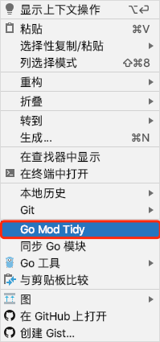
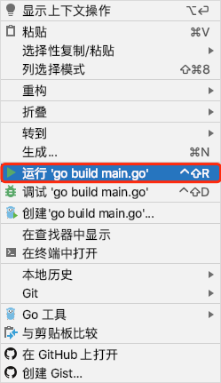

> **server文件夹为Golang后端项目,需要有Golang基础,Gin框架基础**

## 视频推荐

### Golang教学

[【golang教学】第一章：golang的安装和编辑工具安装（1010工作室出品）](https://www.bilibili.com/video/BV1Q7411K7ij)

[【golang教学】第二章：golang的基础知识——结构，包，变量初探（1010工作室出品）](https://www.bilibili.com/video/BV1W7411N7iq)

[【golang教学】第三章：golang基本数据类型和变量初探（1010工作室出品）](https://www.bilibili.com/video/BV1eE411J7QM)

[【golang教学】第四章：golang的流程控制语句（1010工作室出品）](https://www.bilibili.com/video/BV1U64y1u74X)

[【golang教学】第五章：golang的数组和切片（1010工作室出品）](https://www.bilibili.com/video/BV1P5411t7Wr)

[【golang教学】第六章：golang的map声明和使用（1010工作室出品）](https://www.bilibili.com/video/BV1jC4y1x7F7)

[【golang教学】第七章：golang的函数func方法（1010工作室出品）](https://www.bilibili.com/video/BV1mg4y187ZN)

[【golang教学】第八章：golang的指针和地址（1010工作室出品）](https://www.bilibili.com/video/BV1mg4y187pS)

[【golang教学】第九章：golang的结构体struct声明和使用（1010工作室出品）](https://www.bilibili.com/video/BV1Kf4y1S7eP)

[【golang教学】第十章：golang的接口interface介绍和工作中的使用（1010工作室出品）](https://www.bilibili.com/video/BV1WA411b7ZF)

[【golang教学】第十一章：golang的并发神器goroutine 和 channel （1010工作室出品）](https://www.bilibili.com/video/BV1Vf4y1S75t)

[【golang教学】第十二章：golang的断言 Assertion 和 反射 reflect （1010工作室出品）](https://www.bilibili.com/video/BV1S5411x7Bz)

### Gin教学

[【gin教学】第一章：gin的学习前准备工作 hello gin（1010工作室出品）](https://www.bilibili.com/video/BV12i4y1x7AG)

[【gin教学】第二章：gin的get post delete put请求以及获取参数的方式（1010工作室出品）](https://www.bilibili.com/video/BV1Be411p7Jf)

[【gin教学】第三章：使用bind绑定参数和参数验证（1010工作室出品）](https://www.bilibili.com/video/BV1gt4y1173C)

[【gin教学】第四章：gin对于文件的上传和返回（1010工作室出品）](https://www.bilibili.com/video/BV1GA411t7BR)

[【gin教学】第五章：gin的中间件和路由分组（1010工作室出品）](https://www.bilibili.com/video/BV18C4y1p7Fe)

[【gin教学】第六章：日志介绍以及工具推荐（1010工作室出品）](https://www.bilibili.com/video/BV1Bf4y1y7yh)

[【gin教学】第七章：初识GROM使用GORM进行数据库操作（1010工作室出品）](https://www.bilibili.com/video/BV1Bz411v78U)

[【gin教学】第八章：gorm结构体的创建技巧和结合gin使用（1010工作室出品）](https://www.bilibili.com/video/BV1kC4y1t7Qi)

### gin-vue-admin版本更新说明

[【开源项目教学】gin-vue-admin 2.0目录介绍和自动化开发模式（1010工作室出品）](https://www.bilibili.com/video/BV1aV411d7Gm)

[【gin-vue-admin】06/07更新：UI美化，插件功能，自动化代码增加搜索条件 字段描述 结构体中文描述（1010工作室出品）](https://www.bilibili.com/video/BV1wa4y1Y7oX)

[【gin-vue-admin】V2.1.0大更新：增加字典管理，用户操作日志，从数据库一键创建CURD让自动化更加完善（1010工作室出品）](https://www.bilibili.com/video/BV1hC4y1h7PT)

[【gin-vue-admin】V2.2.0更新：增加日志功能,增加v-auth指令,增加一键打包二进制，增加菜单参数，增加令牌续期（1010工作室出品）](https://www.bilibili.com/video/BV1jk4y127yg)

[【gin-vue-admin】09/20更新：大版本2.3.1发布，gorm更新为v2，项目初始化更加便捷，更多通用功能加入（1010工作室出品）](https://www.bilibili.com/video/BV1Jy4y1k75Z)

## server项目结构

```shell
├── api						
│   └── v1
├── config
├── core
├── docs
├── global
│   └── response
├── initialize
├── middleware
├── model
│   ├── request
│   └── response
├── packfile
├── resource
├── router
├── service
└── utils
    └── upload
```

| 文件夹       | 说明                    | 描述                        |
| ------------ | ----------------------- | --------------------------- |
| `api`        | api层                   | api层 |
| `--v1`       | v1版本接口              | v1版本接口                  |
| `config`     | 配置包                  | config.yaml对应的配置结构体 |
| `core`       | 核心文件                | 核心组件的初始化 |
| `docs`       | swagger文档目录         | swagger文档目录 |
| `global`     | 全局对象                | 全局对象 |
| `--response` | json返回web端的统一封装 | json返回web端的统一封装     |
| `initialize` | 初始化 | 路由,redis,gorm,验证器的初始化 |
| `model`      | 模型层                  | 模型对应数据表              |
| `--request`  | 入参结构体              | 接收前端发送到后端的数据。  |
| `--response` | 出参结构体              | 返回给前端的数据结构体      |
| `packfile`   | 静态文件打包            | 静态文件打包 |
| `resource`   | 静态资源文件夹          | 负责存放                    |
| `router`     | 路由层                  | 路由层 |
| `service`    | service层               | 存放业务逻辑问题 |
| `utils`      | 工具包                  | 工具函数封装            |
| `--upload`      | oss                  | oss接口封装        |

## 本文使用的环境

- 数据库选择mysql

- Goland(2020.2)

## 1. 初始化server项目

- Goland打开server文件夹
- 设置GOPROXY
	- windows:打开File → settings → Go → Go Modules，将 Environment 项的值设置为`GOPROXY=https://goproxy.io,direct`
	- Mac: 打开Goland→Preferences...→Go → Go Modules,将Environment项的值设置为`GOPROXY=https://goproxy.io,direct`
- 打开go.mod文件,在文件空白处鼠标右键点击`Go Mod Tidy`
- 

## 2. config.yaml

- 按照 [config的详细说明](./config) 按需修改,

## 3. 数据库初始化

### 请对应版本进行观看初始化数据的方式

#### V2.0.0~V2.2.0

- 自行新建数据库，并导入server/db的qmPlus.sql

#### V2.3.0~V2.3.31

- `comfig.yaml` 的mysql的账号密码配置自行修改
- `config.yaml` 中的 `system` 下存在一行 `need-init-data: false` 将此参数设定为 `true` 
- 启动项目就自动通过代码方式进行初始化数据 

:::danger 注意

重启项目一定一定一定要记得  `need-init-data: false` 将此参数设定为 false 
:::

#### V2.3.4~master

配置好 `server/config.yaml` 的 `mysql` 中的 `path` , `db-name`, `username ` ,`password`,其他的按需修改,我们 [flipped-aurora](https://github.com/flipped-aurora) 团队为各位使用者准备好了脚本

`windows` 用户

- 直接运行 `server` 目录下的 `initdb.bat` (双击)

`linux`, `mac` 用户

```shell
cd server
make gva
make initdb
```

:::danger 注意

mysql5.7数据库一定注意数据库编码设置为utf8-mb4，忽略掉时间0值校验，否则会出现各种数据报错。

:::

> 说明-今后都会使用gva终端工具进行初始化数据,理由如下:
- V2.3.0~V2.3.31所使用的方式，有人只会改成 `true` ,第二次启动就忘了改为 `false`, 导致server项目启动失败
- 方便新增数据，而不需要跟以前一样修改 `.sql` 文件
- gva终端初始化数据是通过代码+gorm的事务进行添加数据，大概率不同版本的mysql之间一些问题的，规避了字符集的问题问题而导致数据的导入失败，或者乱码问题

## 4. 启动server项目

- 完成后打开main.go, 在文件空白处鼠标右键点击`运行'go build main.go'`,或者使用图中红色框的右边的快捷键组合进行启动项目或者打开goland的终端,输入命令`go run main.go`
- 

## 5. 生成swagger自动化API文档

### 5.1 安装 swagger

- 可以翻墙
````
go get -u github.com/swaggo/swag/cmd/swag
````

- 无法翻墙
由于国内没法安装 go.org/x 包下面的东西，推荐使用 [goproxy.io](https://goproxy.io/zh/) 或者 [goproxy.cn/](https://goproxy.cn/)

```bash
# 如果您使用的 Go 版本是 1.13 及以上(推荐)
# 启用 Go Modules 功能
go env -w GO111MODULE=on 
# 配置 GOPROXY 环境变量
go env -w GOPROXY=https://goproxy.io,direct

# 使用如下命令下载swag
go get -u github.com/swaggo/swag/cmd/swag
```

### 5.2 生成API文档

````
cd server
swag init
````
执行上面的命令后，server目录下会出现docs文件夹，打开浏览器输入 [http://localhost:8888/swagger/index.html](http://localhost:8888/swagger/index.html)，即可查看swagger文档

:::danger 您可能遇到的问题
1. 启动时报数据库启动失败，请检查是否创建qmsql数据库，或者是否是您自行配置的数据库
2. 登录时用户名密码错误，请检查数据库文件是否导入
:::
